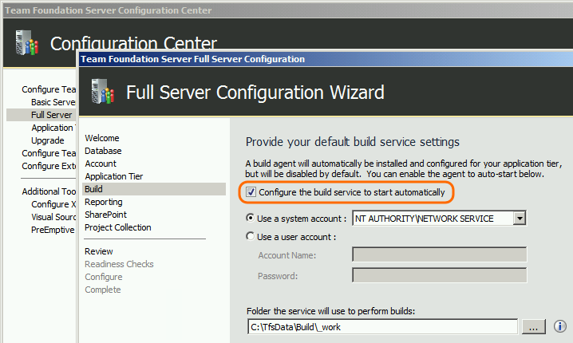
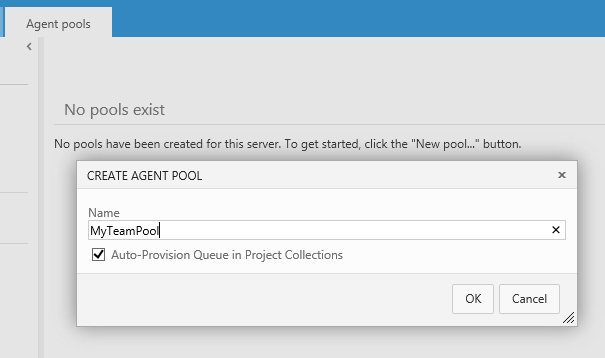
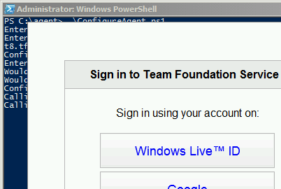
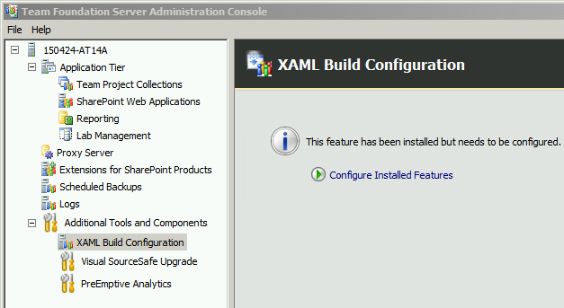

Title: Windows build agents
ms.TocTitle: Windows
Description: Use Windows build agents to build your Windows and Azure code.
toc: show
ms.ContentId: 9FD46361-985B-4886-A042-9C322CE3CD92

#Deploy an agent to build Windows and Azure apps

To build Windows, Azure, and other Visual Studio solutions you'll need at least one Windows build agent.

##Use the hosted pool on Visual Studio Online

Do you keep your code on Visual Studio Online?
If so, you might not need to set up a Windows build agent.
See [Hosted pool](https://www.visualstudio.com/get-started/build/hosted-agent-pool).

##Prerequisites

Before you begin, make sure your build agent machine is set up with:

*   An [operating system that is supported by Visual Studio 2013](http://www.visualstudio.com/products/visual-studio-2013-compatibility-vs) or newer
*   Visual Studio 2013 or Visual Studio 2015
*   PowerShell 3 or newer ([Where can I get a newer version of PowerShell?](#qa_windows_agent_powershell_version))

##If you are installing TFS, you get one build agent

When you install Team Foundation Server (TFS) on-premises, the wizard configures one agent.
Select the box if you want it to run automatically.



Q: I was warned that my version of PowerShell is not sufficient to run the build agent.
[Where can I get a newer version?](#qa_windows_agent_powershell_version)

[//]: # "Add Q&A about error you get if VS 2015 is not installed?"

##Manually deploy a build agent

You can add an on-premises build agent to your on-premises TFS or to your Visual Studio Online account.

<iframe width="420" height="315" src="https://www.youtube.com/embed/ZzrDPmTOEEk" frameborder="0" allowfullscreen="true" caps_internal_Id="f82b5066-903e-4ae4-b644-ffc91e2fbc26" />

###Create a pool

1.  Open your account (on-premises `http://{your_server}:8080/tfs` or Visual Studio Online `https://{your_account}.visualstudio.com`) in your web browser.
2.  Go to the control panel.
    
    
3.  Create a new pool.
    
    
    
    

####Q: I'm having trouble working with our agent pools. What do I do?

A: Some common problems caused by permission issues include:

*   Can't see agent pools.
*   Blocked by a permissions error when trying to create an agent pool.

Make sure you have permission to work with agent pools.
See [Scale out and administer your build system](admin.md).

###Create a queue

1.  Open a team project (on-premises `http://{your_server}:8080/tfs/DefaultCollection/{your_project}` or Visual Studio Online `https://{your_account}.visualstudio.com/DefaultCollection/{your_project}`) in your web browser.
2.  Go to the control panel.
    
    
3.  Go to the collection settings and create a new queue.
    
    
    
    

###Download and configure the agent

1.  On the machine where you are going to run the build agent, open a team project (on-premises `http://{your_server}:8080/tfs/DefaultCollection/{your_project}` or Visual Studio Online `https://{your_account}.visualstudio.com/DefaultCollection/{your_project}`) in your web browser.
2.  Go to the control panel.
    
    
3.  Download the build agent software.
    
    
4.  Unzip the .zip file into the folder on disk from which you would like to run the agent.
    To avoid long-path problems, keep the path as short as possible.
    For example: c:\agent\
5.  Run PowerShell as Administrator.
6.  Change to the directory where you unzipped the agent.


```
cd c:\agent

```

1.  `.\ConfigureAgent.ps1`
2.  Press Enter to use the default agent name.


```
Enter the name for this agent (default is Agent-My-Machine-Name):

```

1.  Enter the URL:


```
Enter the url for the Team Foundation Server (ex. https://myaccount.visualstudio.com): https://fabrikamfiber.visualstudio.com

```


1.  Press Enter to use the default pool


```
Configure this agent against which pool? (default pool name is 'default'):

```

[Q: How do I use pools to organize agents and maintain permission boundaries?](admin.md#agent-pools)

1.  Press Enter.


```
Enter the path of the work folder for this agent (default is the Root Folder of VSOAgent):

```

1.  In most cases, enter Y to run the agent as a service.
    Enter N if you want to run the agent in interactive mode.


```
Would you like to install the agent as a Windows Service (Y/N):

```

[Q: Why would I want to run a build agent in interactive mode?](#interactive)

1.  If you are running the agent as a service, specify the user account.
    In most cases you should press Enter.


```
Enter the name of the user account to use for the service (default: NT AUTHORITY\NetworkService):

```

If you specify a user account instead of using network service, then you are prompted for a user name and password.

1.  Sign in as the user that owns the Visual Studio Online account or as an [agent pool administrator](#q-How-do-I-use-pools-to-organize-agents-and-maintain-permission-boundaries-).
    This user is only used during the configuration process.
    Once the agent is configured it will connect to the server or vso account using the specified [service account](admin.md#managing-permissions).
    
    

You can verify that the agent is ready to go from the control panel.


##Next step: Scale out and administer your build system

[Scale out and administer your build system](admin.md)

##Q&A

[!INCLUDE [temp](_shared/qa-windows-agent-powershell-version.md)]

[!INCLUDE [temp](../_shared/qa-no-agent-with-capabilities.md)]

<a name="interactive"></a>

####Why would I want to run a build agent in interactive mode?

You can run build agent in interactive mode or as a service as mentioned above.
You can use interactive mode to:

*   Run coded UI tests.
*   See what the build agent is doing in real time, for example to debug a problem in your build process.

####How do system capabilities work?

System capabilities are name/value pairs that you can use to ensure that your build definition is run only by build agents that meet criteria specified by you.
Environment variables automatically appear in the list.
Some capabilities (such as .Net frameworks) are also added automatically.
You can also manually add capabilities to the list.

[//]: # "Add screenshot of capabilities"

When a build is queued, the system sends the job only to agents that have the capabilities demanded by the build definition.

[//]: # "Add screenshot of demands"

####Can I still configure and use XAML build controllers and agents?

Yes.
If you are an existing customer with custom build processes you are not yet ready to migrate, you can continue to use XAML builds, controllers, and agents.



####Where is the guidance about the XAML builds?

[MSDN: Build the application](http://msdn.microsoft.com/en-us/library/ms181709%28v=vs.120%29.aspx).

####What's the name of the service?

If you run the agent as a service, it is named: "VSO Agent (&lt;name of your agent&gt;)".


