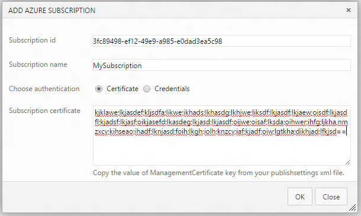

Title: Build and Deploy your ASP.NET 5 Application to an Azure Web App
ms.TocTitle: Deploy ASP.NET 5 to Azure
Description: Build and Deploy your ASP.NET 5 Application to an Azure Web App
toc: show
ms.ContentId: B5F1C4D4-6A3D-48A0-9D88-3E1B7BF5D152

#Build and Deploy your ASP.NET 5 Application to an Azure Web App

You can build and deploy your ASP.NET 5 app from Visual Studio Online or your on-premises Team Foundation Server.

**Note:** ASP.NET 5 and DNX (the .NET Execution Environment) is a lean .NET stack for building modern cloud and web apps.
To learn more visit the [aspnet Home project](https://github.com/aspnet/Home) on GitHub.

##Getting Started

Push your code to a Git repository in your team project.

If you don't have code but you want to try this out, you can download some sample code [here](https://github.com/chrisrpatterson/TeamBuildAspNet5Sample).

**Note:** if you are using the sample project you can skip the following steps.

Create a file called Prebuild.ps1 in the folder that contains the global.json


Open it in your favorite editor and add the following code

```ps

#bootstrap DNVM into this session.

&{$Branch='dev';iex ((new-object net.webclient).DownloadString('https://raw.githubusercontent.com/aspnet/Home/dev/dnvminstall.ps1'))}

#load up the global.json so we can find the DNX version

$globalJson = Get-Content -Path $PSScriptRoot\global.json -Raw -ErrorAction Ignore | ConvertFrom-Json -ErrorAction Ignore

if($globalJson)
{
    $dnxVersion = $globalJson.sdk.version
}
else
{
    Write-Warning "Unable to locate global.json to determine using 'latest'"
    $dnxVersion = "latest"
}

#install DNX

#only installs the default (x86, clr) runtime of the framework.

#If you need additional architectures or runtimes you should add additional calls

#ex: & $env:USERPROFILE\.dnx\bin\dnvm install $dnxVersion -r coreclr

& $env:USERPROFILE\.dnx\bin\dnvm install $dnxVersion -Persistent

 # run DNU restore on all project.json files in the src folder including 2>1 to redirect stderr to stdout for badly behaved tools
Get-ChildItem -Path $PSScriptRoot\src -Filter project.json -Recurse | ForEach-Object { & dnu restore $_.FullName 2>1 }


```
Create a Scripts folder in your repository and add a file called PublishAspNet5Website.ps1. Open the file in your favorite editor and add the following code.

```ps
param($websiteName, $packOutput)

$website = Get-AzureWebsite -Name $websiteName

# get the scm url to use with MSDeploy.  By default this will be the second in the array
$msdeployurl = $website.EnabledHostNames[1]


$publishProperties = @{'WebPublishMethod'='MSDeploy';
                        'MSDeployServiceUrl'=$msdeployurl;
                        'DeployIisAppPath'=$website.Name;
                        'Username'=$website.PublishingUsername;
                        'Password'=$website.PublishingPassword}


$publishScript = "${env:ProgramFiles(x86)}\Microsoft Visual Studio 14.0\Common7\IDE\Extensions\Microsoft\Web Tools\Publish\Scripts\default-publish.ps1"


. $publishScript -publishProperties $publishProperties  -packOutput $packOutput

```

Commit and push these changes.

##Register your Azure subscription

Before you can setup a definition to deploy your application you need to add your Azure Subscription to your team project collection.
You will only need to do this once per subscription.

1.  Go to your project page (`https://{youraccount}.visualstudio.com/DefaultCollection/{yourteamproject}`) and click on the small gear in the upper right corner.
2.  Select the `Services` tab and click Add new Azure Subscription link on the top left.
3.  Click on Add new Azure Subscription in the top left and fill in your subscription details.
    
    

To get your subscription file:

*   Open a Microsoft Azure PowerShell window
*   Type Get-AzurePublishSettingsFile
*   This will open a browser and automatically download your subscription file.
*   Open the subscription file named SubscriptiionName.Date-credentials.publishsettings
*   Location the SubscriptionId and ManagementCertificate elements

##Create the definition

1.  Go to your project page (`https://{youraccount}.visualstudio.com/DefaultCollection/{yourteamproject}`) and click on the `Build.Preview` hub.
2.  Click on the green plus sign and select Visual Studio from the Definition Templates dialog and click ok.
3.  For now remove the Visual Studio Test and Index Sources steps.
4.  Click on the `Repository` tab and make sure the repository containing your application is selected.
    By default a new definition selected the repository with the same name as the team project.
5.  Add a PowerShell build step and drag and drop to the top of the list.
6.  In the `Script filename:` input browse to the `PreBuild.ps1` script.
    Select it and click OK.
7.  Select the Visual Studio Build step and in the `Solution` input browse to the .xproj.
    Select it and click OK.
8.  In the `MSBuild Arguments` input add the following properties.
    `/t:Build,FileSystemPublish /p:PublishConfiguration=$(BuildConfiguration) /p:PublishOutputPathNoTrailingSlash=$(Build.SourcesDirectory)\{yourProjectName}\artifacts\bin\$(BuildConfiguration)\Publish`
    
    **Note:**`$(Build.SourcesDirectory)` is one of a number of variables you can use in your build definition, you can learn more [here](../scripts/variables.md)
9.  Add an Azure PowerShell step and drage and drop it above the Publish Build Artifacts step.
10.  In the `Azure Subscription` input select the subscription you regsitered above.
11.  In the `Script Path` input browse to the `PublishAspNet5Website.ps1` script in your repository.
12.  In the `Script Arguments` input add the following parameters.
    `-websiteName {yourWebsiteName} -packOutput $(Build.SourcesDirectory)\{yourProjectName}\artifacts\bin\$(BuildConfiguration)\Publish`
    
    **Note:** -websiteName should be the name of a Web App you have created in your Azure Subscription referenced above.
13.  Save your definition
14.  Click `Queue build...` and click `OK` in the dialog.


