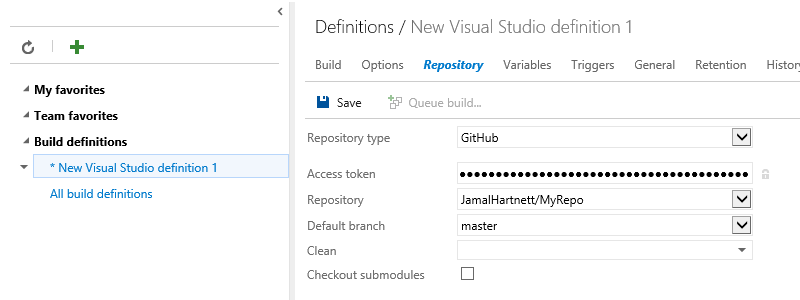
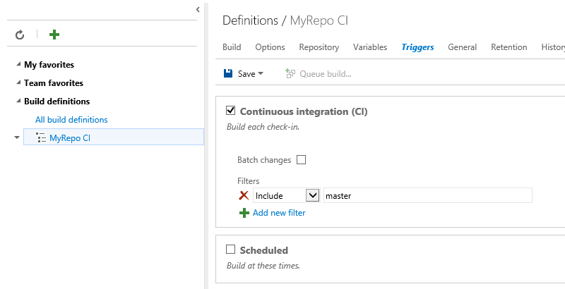

Title: Build your GitHub-hosted projects in Visual Studio Online
ms.TocTitle: In GitHub
ms.ContentId: 03C7B380-4767-42E4-B99E-37911F70CAB5

#Build your GitHub-hosted projects in Visual Studio Online

##Before you start

1.  If you don't have a Visual Studio Online account, [create one](https://visualstudio.com).
2.  If you don't have a build agent, set up a [Windows agent](../agents/windows.md) or an [Xplat agent](../agents/windows.md).
3.  Make sure you have permission GitHub to read the repository and in your team project
    on Visual Studio Online to create a build definition.
    (If you just created an account, you do have this permission.)
4.  If you're going to set up continuous integration build,
    you need to administrator permissions in both the GitHub repo
    and the Visual Studio Online team project.

##Create a build definition

1.  In GitHub, [create an access token](https://help.github.com/articles/creating-an-access-token-for-command-line-use/).
    Use the **repo**, **user**, **admin:repo_hook** scopes
    so that Visual Studio Online can discover private and public repositories that you have access to,
    create a web hook in GitHub (which is what queues the build in Visual Studio Online),
    and fetch the contents of the repository during the build.
2.  In your team project in Visual Studio Online, go to the Build explorer page and add a build definition.
    
    
3.  On the repository tab, fill out your GitHub repository information, and provide the access token you just created.
    
    
4.  Depending on the template you used, you might need to confugure some settings in the **Build** or **Options** tab, too.
5.  If you want to set up a CI build, do that on the triggers tab.
    
    
    
    That will set up a web hook in the GitHub repository to let Visual Studio Online know to queue a build.
    If there's an error, you might not have permission in the GitHub repository to set up web hooks.
    If that's the case, just turn off the CI trigger and you can still queue your builds manually or on a schedule.

##Test your CI build

1.  From the Build.Preview explorer page, look at the queued builds for your build definition.
    (It's probably empty right now).
    
    !(_img/build-queue.png)
2.  Push a change to the GitHub repository.
3.  Switch back to Visual Studio Online and wait for a queued build to appear. 
    
    !(_img/queued-build.png)
4.  In the build summary, there's a link to the GitHub commit that triggerd the build. 
    
    !(_img/completed-build.png)
5.  Click this link to open a new browser window with a summary of the changes in the commit in GitHub. 
    
    !(_img/github-commit.png)

##Q & A

####Q: Will CI builds be triggered for a pull request?

A: No.
Builds can only be queued when code is pushed to the repository,
not on pull requests.
We're evaluating how best to implement this feature.

